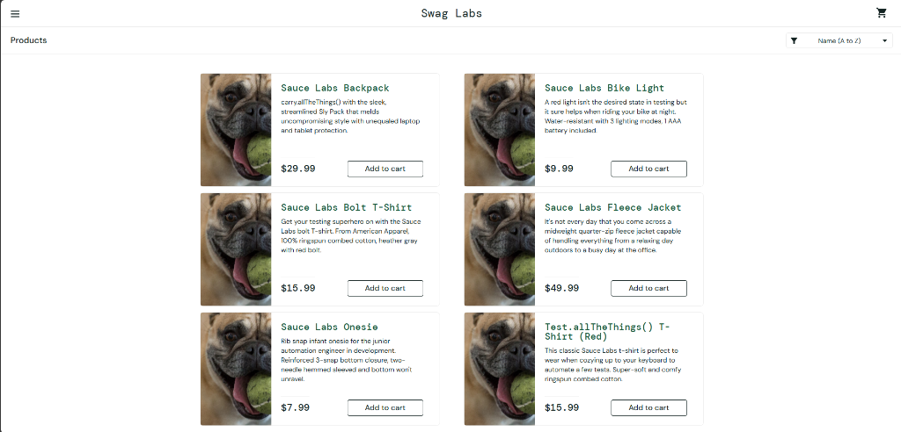
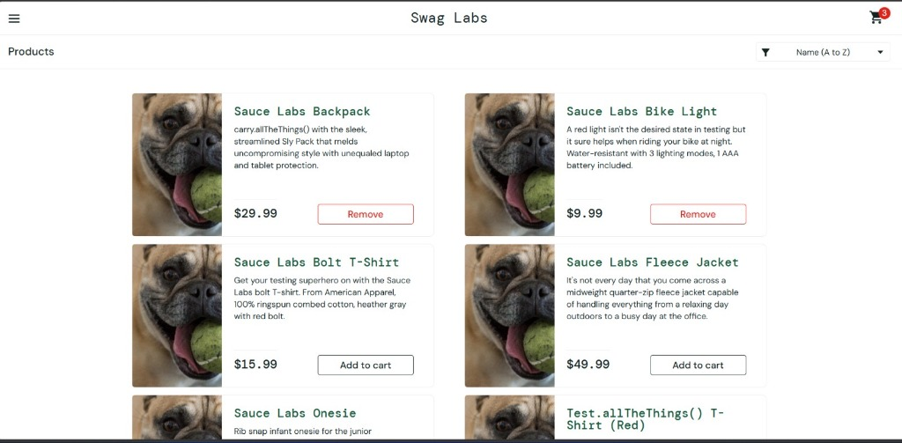
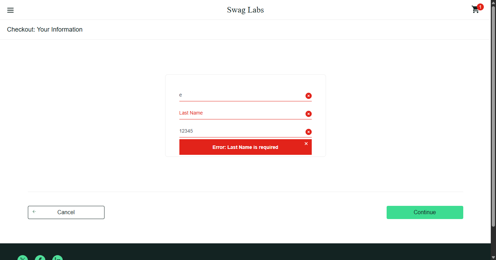
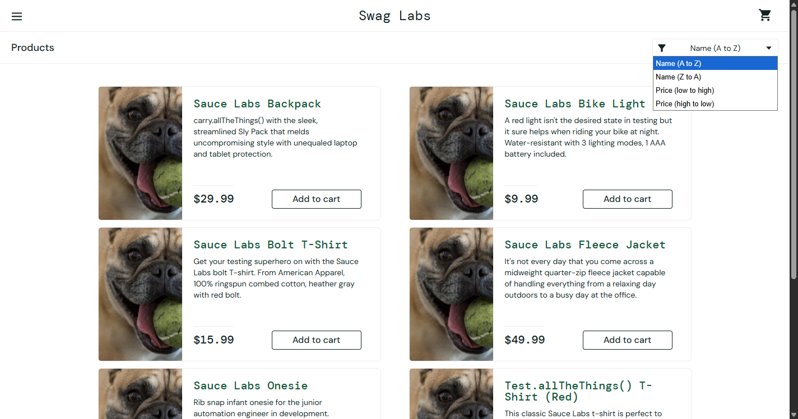
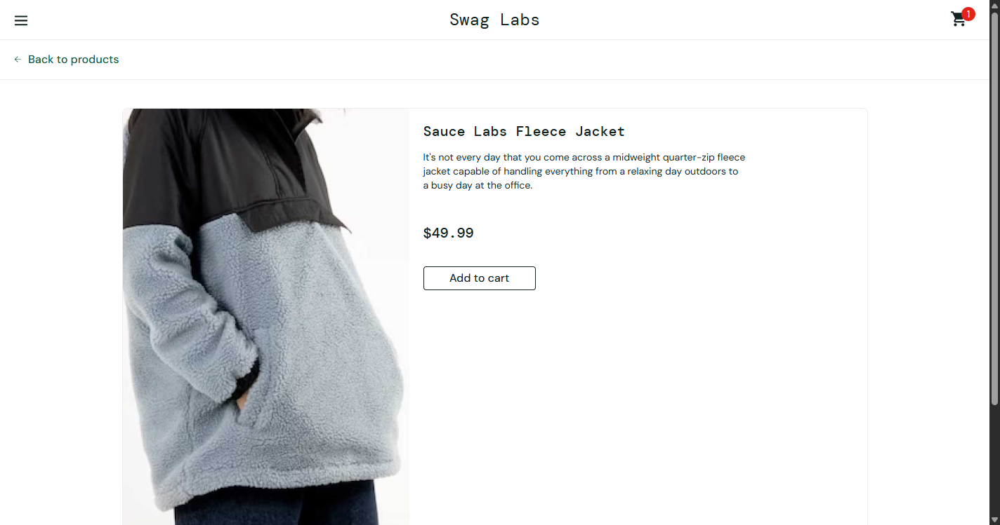

# Bug Report – SauceDemo Exploration (`problem_user`)

This bug report documents defects identified during exploratory testing of [SauceDemo](https://www.saucedemo.com) using the `problem_user` persona credentials (`problem_user` / `secret_sauce`).

**Tester:** QA Automation Intern  
**Date:** September 2026  
**Environment:** Chrome 134+ / Windows 11 / Desktop (1920x1080)  
**Target URL:** https://www.saucedemo.com  

---

## Executive Summary

The `problem_user` account exposes several severe defects across product discovery, inventory display, sorting, and checkout workflows. Most critically, **BUG-03 represents a complete purchase blocker**: users cannot type into the Last Name field during checkout, which permanently blocks order completion and prevents any revenue generation. Additionally, inventory images fail to load correctly across all product tiles, sorting functionality is completely non-operational, and specific product items fail to add to the cart.

---

## Defect Summary & Severity Matrix

| Bug ID | Title | Component | Severity | Priority | Status |
|---|---|---|---|---|---|
| **BUG-01** | All product cards display identical fallback dog image | Inventory (`/inventory.html`) | High | P2 | Open |
| **BUG-02** | "Add to cart" action fails for selected products | Inventory & Cart | Critical | P1 | Open |
| **BUG-03** | Last Name input field rejects input (Purchase Blocker) | Checkout Step One (`/checkout-step-one.html`) | **Blocker** | **P1** | Open |
| **BUG-04** | Inventory sorting dropdown has no effect on product ordering | Product Catalog Sorting | Medium | P3 | Open |
| **BUG-05** | Product detail page renders corrupted image/state | Product Details (`/inventory-item.html`) | High | P2 | Open |

---

## Detailed Defect Log

### BUG-01: All Product Images Display Identical Fallback Image (Dog Photo)

| Field | Value |
|---|---|
| **Bug ID** | `BUG-01` |
| **Severity** | High |
| **Priority** | P2 |
| **Component** | Inventory Page (`/inventory.html`) |
| **Target URL** | https://www.saucedemo.com/inventory.html |
| **Preconditions** | User is logged in as `problem_user` |
| **Status** | Open |

#### Steps to Reproduce:
1. Navigate to https://www.saucedemo.com
2. Log in with username `problem_user` and password `secret_sauce`
3. Observe the product card image thumbnails across all items on the inventory page

#### Expected Result:
Each product tile should render its own distinct product photograph (e.g. backpack, bike light, bolt t-shirt, fleece jacket, onesie, red t-shirt).

#### Actual Result:
All 6 product cards display the exact same dog image (`sl-404.168b1cce.jpg`). Users cannot visually identify what they are browsing or purchasing.

#### Workaround:
None. The client-side asset reference points to the fallback image.

#### Evidence / Screenshot:

---

### BUG-02: "Add to Cart" Button Action Fails for Selected Products

| Field | Value |
|---|---|
| **Bug ID** | `BUG-02` |
| **Severity** | Critical |
| **Priority** | P1 |
| **Component** | Inventory & Cart Management |
| **Target URL** | https://www.saucedemo.com/inventory.html |
| **Preconditions** | User is logged in as `problem_user` |
| **Status** | Open |

#### Steps to Reproduce:
1. Log in as `problem_user` with password `secret_sauce`
2. Locate the **"Sauce Labs Fleece Jacket"** or **"Sauce Labs Bolt T-Shirt"**
3. Click the **"Add to cart"** button
4. Observe the shopping cart badge count in the top-right header and the button state

#### Expected Result:
- The product is added to the cart
- The button toggles to "Remove"
- The cart badge increments by 1

#### Actual Result:
Clicking "Add to cart" fails silently for specific items. The button does not toggle to "Remove", and the cart badge count remains unchanged at 0.

#### Workaround:
Add alternative products that function (e.g. Sauce Labs Backpack).

#### Evidence / Screenshot:

---

### BUG-03: Last Name Input Field Fails to Accept User Input (Purchase Blocker)

| Field | Value |
|---|---|
| **Bug ID** | `BUG-03` |
| **Severity** | **Blocker** |
| **Priority** | **P1** |
| **Component** | Checkout Step One (`/checkout-step-one.html`) |
| **Target URL** | https://www.saucedemo.com/checkout-step-one.html |
| **Preconditions** | User is logged in as `problem_user` and has added at least 1 item to the cart |
| **Status** | Open |

#### Steps to Reproduce:
1. Log in as `problem_user`
2. Add "Sauce Labs Backpack" to the shopping cart
3. Click the cart icon and click **"Checkout"**
4. Enter First Name (e.g. `John`)
5. Click the **"Last Name"** input field (`#last-name`) and attempt to type text (e.g. `Doe`)
6. Enter Postal Code (e.g. `10001`)
7. Click **"Continue"**

#### Expected Result:
The Last Name input field accepts keyboard input and retains the value. Clicking "Continue" successfully advances to the order summary page (`checkout-step-two.html`).

#### Actual Result:
The Last Name input field either rejects keystrokes or automatically resets to blank. When clicking "Continue", the application rejects submission with:
`Error: Last Name is required`
Because this field cannot be populated, users are permanently blocked from completing checkout.

#### Workaround:
None. Order placement is impossible for this user account.

#### Evidence / Screenshot:

---

### BUG-04: Inventory Sort Dropdown Selection Has No Effect

| Field | Value |
|---|---|
| **Bug ID** | `BUG-04` |
| **Severity** | Medium |
| **Priority** | P3 |
| **Component** | Inventory Filter (`.product_sort_container`) |
| **Target URL** | https://www.saucedemo.com/inventory.html |
| **Preconditions** | User is logged in as `problem_user` |
| **Status** | Open |

#### Steps to Reproduce:
1. Log in as `problem_user`
2. Click the sorting dropdown menu in the top-right corner
3. Select **"Price (low to high)"** or **"Name (Z to A)"**
4. Observe the order of items

#### Expected Result:
Inventory items reorder accordingly (e.g., lowest-priced items first: $7.99 Sauce Labs Onesie).

#### Actual Result:
The dropdown selector changes its selected label in the UI, but the underlying inventory list ordering does not update. The default A-to-Z order remains static.

#### Workaround:
Users must manually scan through all products to find items in desired price/name order.

#### Evidence / Screenshot:

---

### BUG-05: Product Detail Page Displays Broken or Mismatched Content

| Field | Value |
|---|---|
| **Bug ID** | `BUG-05` |
| **Severity** | High |
| **Priority** | P2 |
| **Component** | Product Detail View (`/inventory-item.html`) |
| **Target URL** | https://www.saucedemo.com/inventory-item.html?id=0 |
| **Preconditions** | User is logged in as `problem_user` |
| **Status** | Open |

#### Steps to Reproduce:
1. Log in as `problem_user`
2. Click on the title or thumbnail of **"Sauce Labs Bike Light"**
3. Inspect image and product attributes on the detail view

#### Expected Result:
The item page renders the authentic bike light photograph and allows adding/removing the item consistently.

#### Actual Result:
The detail view renders the dog placeholder image (`sl-404.168b1cce.jpg`) instead of the bike light picture, and the back-to-products or cart actions exhibit state glitches.

#### Workaround:
None for image rendering.

#### Evidence / Screenshot:

